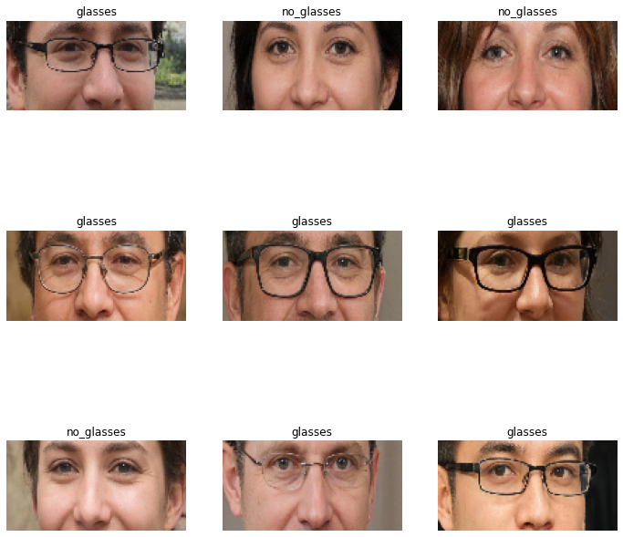
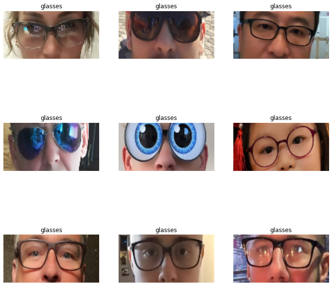

# Glasses Detector
indicates whether the person is wearing glasses. Glasses that are not worn on the bridge of the nose are not classified as worn.

# Operating principle:
With the help of facial landmark detection, a rectangle with the eyes of a person is determined. Next, CNN is used to classify whether there are glasses in this region.

Model for facial landmark detection: https://github.com/ageitgey/face_recognition

Classification model: Mobile Net V3 Small (minimalistic), trained on a dataset https://www.kaggle.com/jeffheaton/glasses-or-no-glasses , with preprocessing . Classification network was then quantized to fp16 resulting in ~2MB in size.

Classification part works ~20ms on i5 2017 year CPU for 1 image.

Landmark detector works good on most of images and it's really fast on CPU with dlib under the hood. If the face is not localized, it switches to CNN approach.

Learning curves for classifier are provided below:<br>


Train samples:<br>


Test samples:<br>


# Installation:
```bash
git clone https://github.com/SlinkoIgor/glasses_detector.git
cd glasses_detector
pip install -r requirements.txt
```

# Example:
On the image folder:
```bash
python test.py --dir=test_data/example_data_glasses/with_glasses
```

On one image:
```python
from test import GlassesPredictor
predictor = GlassesPredictor(model_path='weights/fp16_model.tflite')
predictor.predict_on_image_path('test_data/example_data_glasses/with_glasses/0.jpg')
>>> True
```

# Known issues:
- Bad landmarks detection on rotated images, faces turned in profile and cropped faces
- Bad landmarks detection on people wearing masks

# Ways to improve
1) These landmark detectors should have better quality then the current one:
- https://github.com/1adrianb/face-alignment
- https://github.com/HRNet/HRNet-Facial-Landmark-Detection

2) Glasses classifier works perfectly on my test examples (found in Google). But given more time I'd prefer to increase generalizability by adding a couple of datasets:
- http://mmlab.ie.cuhk.edu.hk/projects/CelebA.html
- https://www.kaggle.com/ashish2001/512x512-face-parsing-segmentation-tfrecords

3) If the face is not detected, the glasses will not be detected either. This negatively affects metrics, but in my opinion is closer to business logic. However, it is possible to get better metrics, strictly considering that the photo has a person's face.

4) No augmentations were harmed during the train procedure – an unfortunate omission.

# Post Scriptum:
It was fun!<br>
The first approach was to use https://github.com/TianxingWu/realtime-glasses-detection . It works on CPU in real time and it does a great job with simple images.<br>
Then I wasted some time with a glasses detector... And after all switched to the current solution.<br>
Thanks for this task<br>
